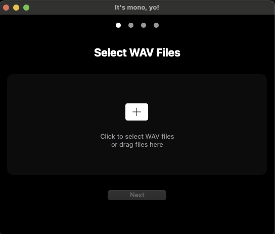

# It's mono, yo!


A macOS application for batch converting WAV audio files to mono format while preserving original sample rates.

[🌐 Visit Website](https://jarllyng.github.io/SampleDrumConverter) | [⬇️ Download Latest Release](https://github.com/JarlLyng/SampleDrumConverter/releases/latest)



Perfect for preparing samples for hardware like the Erica Synths Sample Drum module.

## Features

- Batch conversion of multiple files
- Preserves original sample rate
- Progress tracking for each file
- Error handling with retry option
- Keyboard shortcuts (⌘O, ESC)
- Context menu actions for individual files
- Direct access to converted files in Finder
- Dark mode with two themes
- Step-by-step conversion process
- Drag and drop support
- Automatic update checking
- Responsive design

## System Requirements

- macOS 11.0 or later
- 64-bit processor
- Audio files in WAV format
- Maximum file size: 100 MB per file
- Up to 50 files can be converted in one batch

## Installation

### Download from GitHub
1. Go to the [Releases](https://github.com/JarlLyng/SampleDrumConverter/releases) page
2. Download the latest version
3. Move the app to your Applications folder
4. Right-click and select "Open" the first time you run it

### Building from Source
1. Clone the repository:
   ```bash
   git clone https://github.com/JarlLyng/SampleDrumConverter.git
   ```
2. Open `SampleDrumConverter.xcodeproj` in Xcode
3. Select your development team in signing settings
4. Build and run (⌘R)

## Usage

1. Launch the app
2. Add WAV files:
   - Click the "Select WAV Files" button or use ⌘O
   - Or drag and drop WAV files directly into the app
   - Select one or more WAV files
3. Choose output folder
4. Start conversion
5. Access converted files directly from the completion screen

## Keyboard Shortcuts

- ⌘O: Open file picker
- ESC: Go back/cancel
- More shortcuts coming soon

## Themes

The app comes with two built-in themes:
- Classic Dark: Simple, elegant dark interface
- Modern Dark: Rich, gradient-based theme with accent colors

## Known Issues

- Large files (>100MB) are not supported
- Only WAV files are supported
- System audio dialogs may appear behind the app window

## Release Notes

### Version 1.0.6
- Added drag and drop support
- Added automatic update checking
- Added keyboard shortcuts
- Added modern theme option
- Improved responsive design
- Various UI improvements

### Version 1.0.5
- Initial release
- Basic stereo to mono conversion
- Batch processing support
- Dark mode interface
- Step-by-step UI

## Contributing

1. Fork the repository
2. Create your feature branch (`git checkout -b feature/AmazingFeature`)
3. Commit your changes (`git commit -m 'Add some AmazingFeature'`)
4. Push to the branch (`git push origin feature/AmazingFeature`)
5. Open a Pull Request

## License

This project is licensed under the MIT License - see the [LICENSE](LICENSE) file for details.

## Acknowledgments

- Built with SwiftUI and AVFoundation
- Icons from SF Symbols
- Testing support from the macOS developer community